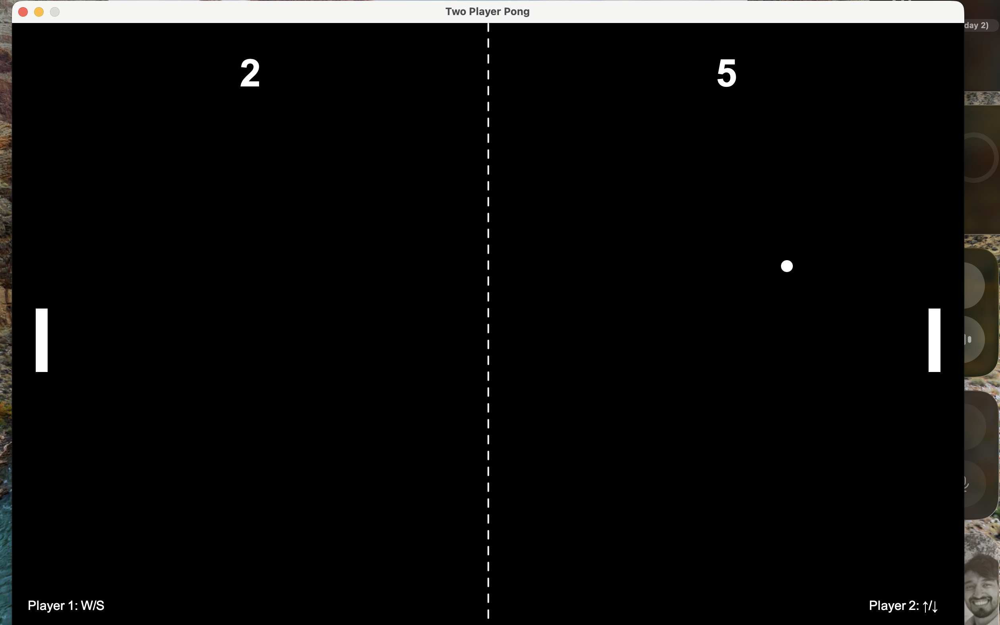

# PingPong

A classic two-player Pong game implemented in Java using a custom GDV5 framework.

## Features
- Two-player local gameplay
- Smooth paddle and ball movement
- Score tracking and win condition
- Keyboard controls:
  - Player 1: W/S keys
  - Player 2: Up/Down arrow keys
- Game over screen and restart option

## Project Structure
```
PingPong/
├── src/
│   ├── Main.java           # Entry point
│   ├── game/
│   │   ├── GDV5.java      # Game framework
│   │   └── PongGame.java  # Pong game logic
│   └── objects/
│       ├── Ball.java      # Ball class
│       └── Paddle.java    # Paddle class
├── README.md              # Project documentation
```

## How to Run
1. Make sure you have Java (JDK 8+) installed.
2. Compile all Java files:
   ```sh
   javac src/Main.java src/game/*.java src/objects/*.java
   ```
3. Run the game:
   ```sh
   java -cp src Main
   ```
4. Enjoy playing!
   
## How to Play
- Player 1 uses `W` and `S` to move their paddle up and down.
- Player 2 uses the `Up` and `Down` arrow keys.
- First player to reach 10 points wins.
- Press `R` to restart after a game over.

## Contributing
Pull requests and suggestions are welcome!

## License
This project is open source and available under the MIT License.

